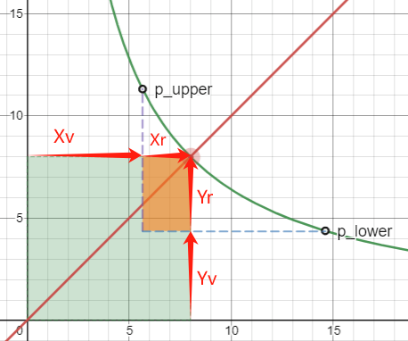
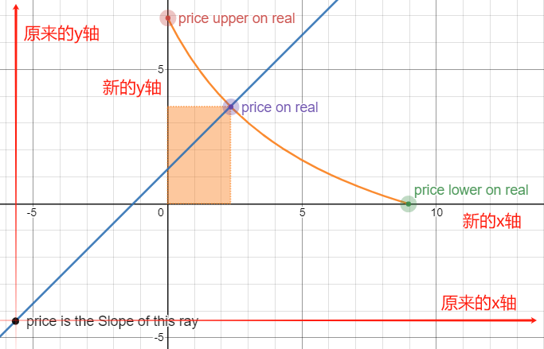
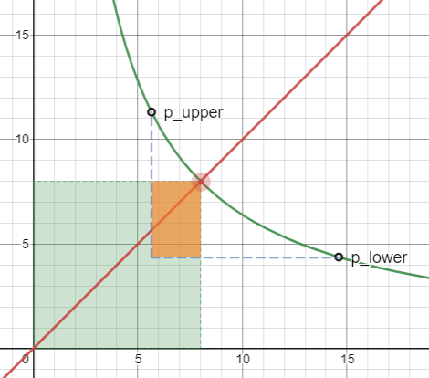
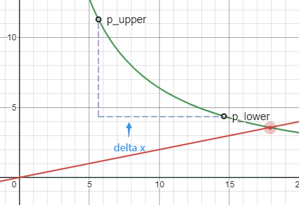
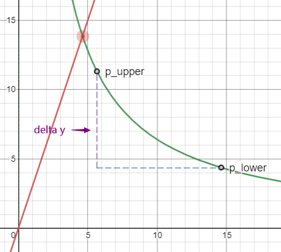
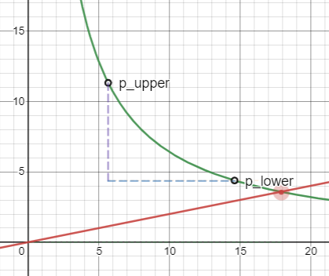

1. 行内公式，比如 $E = mc^2$

2. 块级公式: 
            $$
            a^2 + b^2 = c^2
            $$

3. 常见的 LaTeX 语法
    乘积：$ x \times y = k $
    分数：$ \frac{a}{b} $
    开平方：$ \sqrt{x} $
    求和：$ \sum_{i=1}^{n} i^2 $
    积分：$ \int_0^1 x^2 dx $
    方程组：
            \[
            \begin{cases}
            x*y = k \\
            y = p*x
            \end{cases}
            \]
    小空格：\,  \:  \;
    中空格：\quad
    大空格：\qquad

4. 绘制表格：
| 左对齐 | 居中对齐 | 右对齐 |
| :--- | :---: | ---: |
| 单元格1 | 单元格2 | 单元格3 |
| 单元格4 | 单元格5 | 单元格6 |

| 符号          |   含义            |
| :---:         | :---:             |
| x             | InputReserve      |
| $ \Delta x $  | InputAmount       |
| y             | OutputReserve     |
| $ \Delta y $  | OutputAmount      |

#### 1. UniSwap V3 中的虚拟流动性
当用户用 X 换取 Y 的时候，价格会从低点涨到高点，红点从 $ p_{lower} $ 移动到 $ p_{upper} $ 的过程中，实际参与交易的流动性仅仅是橙色的矩形区域，但是在 UniSwap V2 中，需要提供整个绿色区域的流动性，可以看到橙色区域占整个绿色区域的比例是较小的。因此在 UniSwap V2 中，资金的利用率不高。
提高利用率的关键是既要移除那些躺在那不干活的流动性（绿色区域），又要保证这个函数模型不变。于是我们将其换成了虚拟的流动性，即 $ x_{virtual} $  和 $ y_{virtual} $，而添加流动性时，只需要注入橙色区域的流动性即可。于是公式变成了如下模样。
$$
(x_{virtual} + x_{real}) \cdot (y_{virtual} + y_{real}) = k
$$

|    没有添加虚拟流动性      |     添加了虚拟流动性          |
|       :---:               |        :---:                |
|   |     |

#### 2. 核心公式推导：
在 UniSwap V3 中添加流动性，需要用户自己设置需要做市的价格区间，即自己设定 $ [p_{min}, \; p_{max}] $
联立方程组：
\[
\begin{aligned}
&\begin{cases}
x \cdot y = L^2 \\
y = p \cdot x
\end{cases} &
\Rightarrow \quad & 
\begin{cases}
x = \frac{L}{\sqrt{p}} \\
y = L \cdot \sqrt{p}
\end{cases} &
\Rightarrow \quad & 
\begin{cases}
x_v + x_r = \frac{L}{\sqrt{p}} \\
y_v + y_r = L \cdot \sqrt{p}
\end{cases}
\end{aligned}
\]

当 $ p = p_{min} $ 时，$ y_r = 0 $，得到了 $ y_v = L \cdot \sqrt{p_{min}} $
当 $ p = p_{max} $ 时，$ x_r = 0 $，得到了 $ x_v =  \frac{L}{\sqrt{p_{max}}} $
代入之后：
\[
\begin{aligned}
& (x_{virtual} + x_{real}) \cdot (y_{virtual} + y_{real}) = L^2 & 
\Rightarrow \quad & 
(x + \frac{L}{\sqrt{p_{max}}}) \cdot (y + L \cdot \sqrt{p_{min}}) = L^2
\end{aligned}
\]

#### 3. 添加流动性
添加流动性的计算过程，是已知当前价格和输入的其中一种资产数量，计算另一种资产的数量和添加的流动性数量。
V2 中添加流动性只需要按照对应的比例添加即可，即：$ \frac{x}{y} = \frac{\Delta x}{\Delta y} $，然后将两个资产数量相乘就得到了流动性的数量 $ x \cdot y=k $。
为了方便理解 $ \Delta x = x_{real} $, $ \Delta y = y_{real} $
\[
\begin{aligned}
\begin{cases}
x_{real} + \frac{L}{\sqrt{p_{max}}} = \frac{L}{\sqrt{p}} \\
y_{real} + L \cdot \sqrt{p_{min}} = L \cdot \sqrt{p}
\end{cases}
\Rightarrow \qquad & 
\begin{cases}
\Delta x = \frac{L}{\sqrt{p}} - \frac{L}{\sqrt{p_{max}}} \\
\Delta y = L \cdot \sqrt{p} - L \cdot \sqrt{p_{min}}
\end{cases}
\end{aligned}
\]
$ \Delta x $ 和 $ \Delta y $ 就是橙色区域的宽高，在这里我们是已知其中一个的，不论给定的是 x 的数量，还是 y 的数量，我们都能得到将要添加的流动性数量 L。拿到 L 之后，根据另一个等式可以求得另一个资产的数量。

由于自定义价格区间的存在，因此需要分为以下三种情况
| $ p ∈ [p_{min}, \; p_{max}] $ | $ p < p_{min} $ | $ p > p_{max} $ |
| :---: | :---: | :---: |
||||

##### 3.1 当 $ p ∈ [p_{min}, \; p_{max}] $。
添加的价格 $ p $ 属于 自定义的价格区间内：
\[
\begin{aligned}
\begin{cases}
\Delta x = \frac{L}{\sqrt{p}} - \frac{L}{\sqrt{p_{max}}} \\
\Delta y = L \cdot \sqrt{p} - L \cdot \sqrt{p_{min}}
\end{cases}
\end{aligned}
\]

##### 3.2 当 $ p < p_{min} $。
添加的价格 $ p $ 低于自定义的最低价格
此时 $ y_{real} = 0 $，也就是 $ \Delta y = 0 $，意味着只需要添加X代币就可以了。 
\[
\begin{aligned}
\begin{cases}
\Delta x = \frac{L}{\sqrt{p_{min}}} - \frac{L}{\sqrt{p_{max}}} \\
\Delta y = 0
\end{cases}
\end{aligned}
\]

##### 3.3 当 $ p > p_{max} $。
添加的价格 $ p $ 高于自定义的最高价格
此时 $ x_{real} = 0 $，也就是 $ \Delta x = 0 $，意味着只需要添加Y代币就可以了。 
\[
\begin{aligned}
\begin{cases}
\Delta x = 0 \\
\Delta y = L \cdot (\sqrt{p_{max}} - \sqrt{p_{min}})
\end{cases}
\end{aligned}
\]

#### 4. 限价单功能
查看下面的变化，X代币的价格逐渐升高，同时X代币的数量逐渐减少，Y代币的价格不断增加，意味着 UniSwap V3 不断地在卖出X代币，换为Y代币。
详细来说：当你看好 Y（或者看空 X），于是故意设置了一个比较窄的价格区间（容易被价格穿过），放在比当前价格高的地方，此时注入流动性，将会全部是资产 X。当资产 X 价格上涨时，先进入你的流动性价格区间，不断有人用资产 Y 换走你池内的资产 X，直至价格完全穿过价格区间的上限，池内的资产 X 被全部换成了资产 Y。

回看整个过程，我们在一个价格区间内，完成了资产 X 到资产 Y 的转换，这就是一种变相的限价单功能。和传统的限价单不同的有两点：
如果价格不能完全穿过整个价格区间，那么只会有部分资产被转换成另一种资产
在转换完成后，请一定要记得将流动性移除，否则当价格再次回到区间内，又会做一次逆向的交易（将资产 Y 又换成了资产 X）

#### 5. 无常损失
