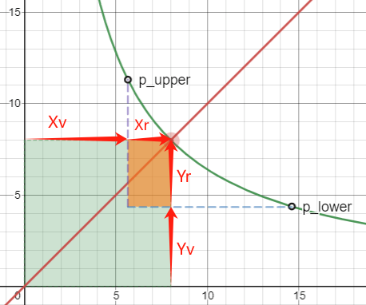
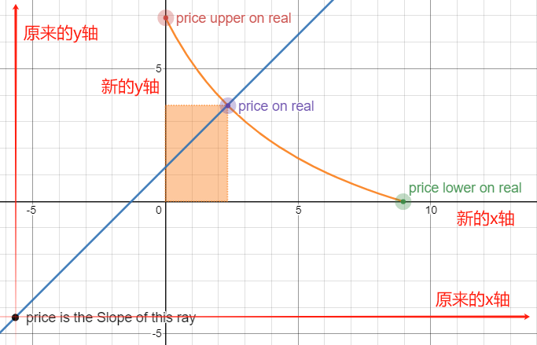

1. 行内公式，比如 $E = mc^2$

2. 块级公式: 
            $$
            a^2 + b^2 = c^2
            $$

3. 常见的 LaTeX 语法
    乘积：$ x \times y = k $
    分数：$ \frac{a}{b} $
    开平方：$ \sqrt{x} $
    求和：$ \sum_{i=1}^{n} i^2 $
    积分：$ \int_0^1 x^2 dx $
    方程组：
            \[
            \begin{cases}
            x*y = k \\
            y = p*x
            \end{cases}
            \]
    小空格：\,  \:  \;
    中空格：\quad
    大空格：\qquad

4. 绘制表格：
| 左对齐 | 居中对齐 | 右对齐 |
| :--- | :---: | ---: |
| 单元格1 | 单元格2 | 单元格3 |
| 单元格4 | 单元格5 | 单元格6 |

| 符号          |   含义            |
| :---:         | :---:             |
| x             | InputReserve      |
| $ \Delta x $  | InputAmount       |
| y             | OutputReserve     |
| $ \Delta y $  | OutputAmount      |

1. UniSwap V3 中的虚拟流动性：
当用户用 X 换取 Y 的时候，价格会从低点涨到高点，红点从 p_lower 移动到 p_upper 的过程中（X 的价格），实际参与交易的流动性仅仅是橙色的矩形区域，在 UniSwap V2 中，需要提供整个绿色区域的流动性，但可以看到橙色区域占整个绿色区域的比例是较小的。因此在 UniSwap V2 中，资金的利用率不高。 
提高利用率的关键是既要移除那些躺在那不干活的流动性（绿色区域），又要保证这个函数模型不变。于是我们将其换成了虚拟的流动性，即 x_virtual 和 y_virtual，而添加流动性时，只需要注入橙色区域的流动性即可。于是公式变成了如下模样。
$$
(x_{virtual} + x_{real}) \cdot (y_{virtual} + y_{real}) = k
$$

|    没有添加虚拟流动性      |     添加了虚拟流动性          |
|       :---:               |        :---:                |
|   |     |

 
2. 核心公式推导：
在 UniSwap V3 中添加流动性，需要用户自己设置需要做市的价格区间的，即确定 
$$ [p_{min}, p_{max}] $$